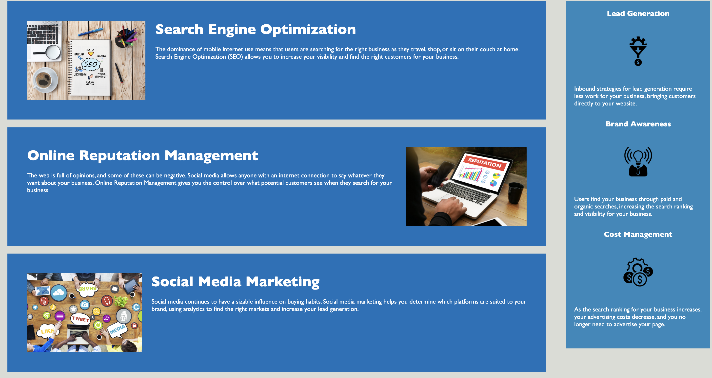

# Week 1 challenge/Horiseon Digital Marketing Website

## Description

The purpose of this project was to take existing code for the Horiseon Web Application and make it more accesible by changing existing elements to semantic html elements. 

The following includes the User Story and Acceptance Criteria for the project. 

**User Story**
- AS A marketing agency
- I WANT a codebase that follows accessibility standards
- SO THAT our own site is optimized for search engines

**Acceptance Criteria**
- GIVEN a webpage meets accessibility standards
- WHEN I view the source code
- THEN I find semantic HTML elements
- WHEN I view the structure of the HTML elements
- THEN I find that the elements follow a logical structure independent of styling and positioning
- WHEN I view the image elements
- THEN I find accessible alt attributes
- WHEN I view the heading attributes
- THEN they fall in sequential order
- WHEN I view the title element
- THEN I find a concise, descriptive title

In completeing this assignment I improved the existing code by: removing non semantic code elements and replaced them with semantic elements thus making it more accesible and I fixed the error of the "Search Engine Optimization" link not working. I was able to apply the skills in HTML and CSS that I learned in week 1 of the coding bootcamp. 

## Usage

When you click on the link: it will take you to the web application for Horiseon Digital Marketing Page. Across the top of the page is the **navigation bar** with active links to information contained in the body of the web application. 

## Credits

The starter code for this project was created by: https://github.com/Xandromus

When trying to determine what semantic elements to use I referred primarily to this site: https://developer.mozilla.org/en-US/docs/Glossary/Semantics

## License
Please refer to the license in the repo.
